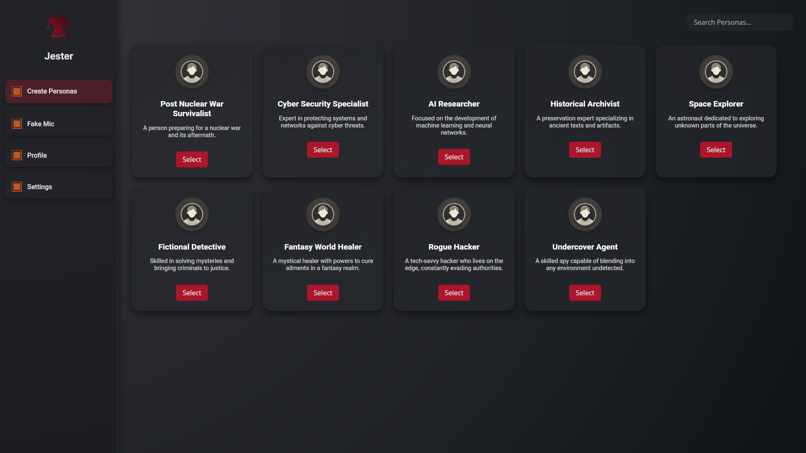
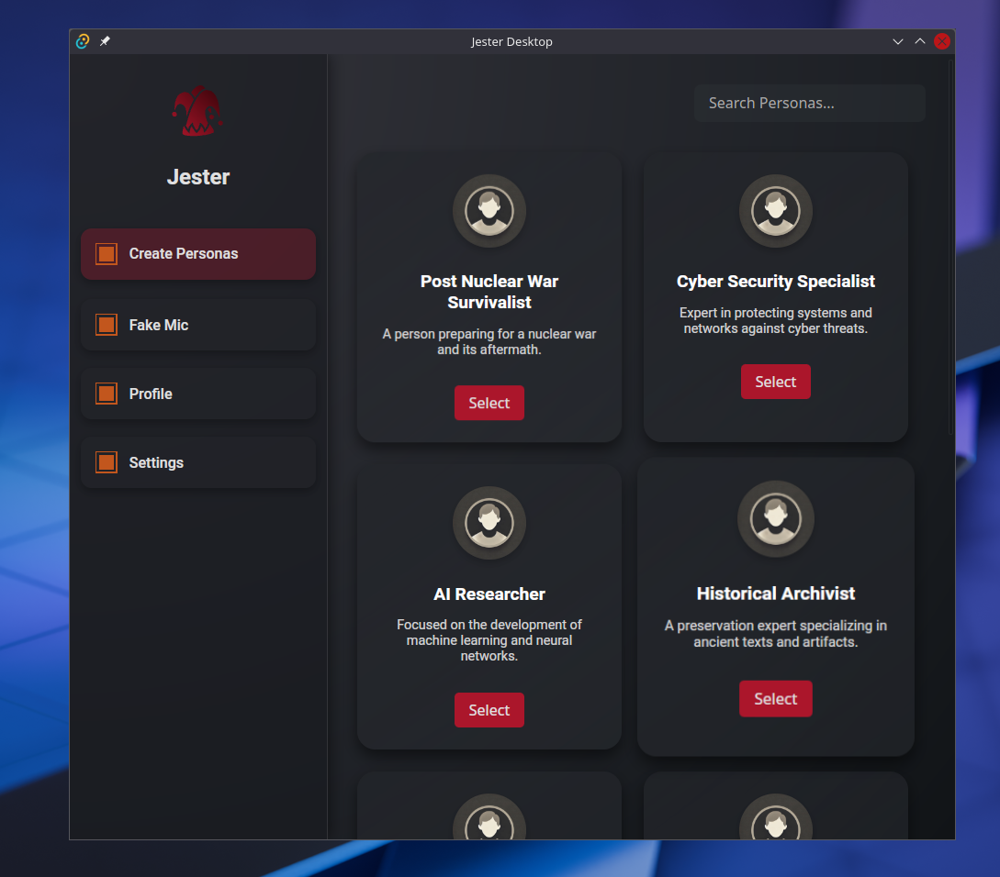

# Tauri + Vanilla

This template should help get you started developing with Tauri in vanilla HTML, CSS and Javascript.

## Recommended IDE Setup

- [VS Code](https://code.visualstudio.com/) + [Tauri](https://marketplace.visualstudio.com/items?itemName=tauri-apps.tauri-vscode) + [rust-analyzer](https://marketplace.visualstudio.com/items?itemName=rust-lang.rust-analyzer)

## Tools for Building:

Needed for creating new project
```
cargo install create-tauri-app --locked
```

Needed for running and building project

````
cargo install tauri-cli --version "^2.0.0" --locked
````


Run project for dev:
```
cargo tauri dev
```

# Current Look


