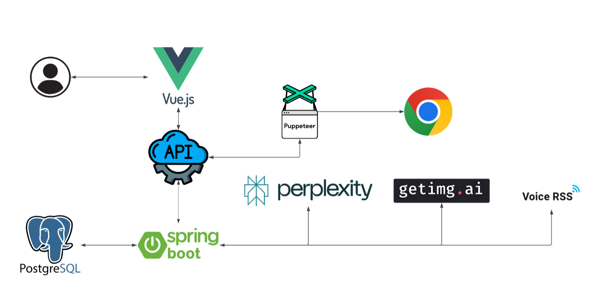

# Jester Desktop [](https://forthebadge.com)

Do you hate being tracked on the internet? 

Are you creeped out by mass surveilence systems of big companies?

Do you want to preserve at least some of your privacy?

Well, we do as well. Thats why we created Jester!

Jester is a tauri based app which obfuscates user data sent to web trackers. We do this by generating fake browsing activity based on the persona description you give to our app!

Example: Use our *Post Nuclear War Survivalist* persona to make the companies spying on you think that you are preparing for nuclear war! Or even better create your own persona using our AI based solution.

Our app shows that it does indeed work by changing and manipulating your ads and suggested products on sites such as Amazon and Ebay. 

## Details

This app uses Tauri as its main build system, we also use a Deno Oak based local server to manage the browsing activities. The Deno Server, which can be seen as a submodule in this repository, gets built using `deno compile`, the binary thens gets bundled into the Tauri installer using [Sidecars](https://v2.tauri.app/develop/sidecar/).

Please View The Project Report at: https://typst.app/project/r2CdlctLgV2GHva5fPgstL

# Architecture

SpringBoot Backend API: https://github.com/FoolingWebTrackers/springboot-backend \
Puppeeteer Backend API: https://github.com/FoolingWebTrackers/jester-puppeteer-backend \
PostgreSQL Container: https://github.com/FoolingWebTrackers/postgresql-container \
~~Chrome Extension: https://github.com/FoolingWebTrackers/jester~~ (Deprecated)

# Installation
Go to the release page to download the corresponding installation package for your opearing system.
We have Windows, Linux (RPM, DEB, AppImage) and macOS (intel/apple) installers.

# Development
```
git clone --recurse-submodules https://github.com/FoolingWebTrackers/jester_desktop
```
## Make sure you have installed the prerequisites for your OS: https://tauri.app/start/prerequisites/, then run:

```
cd jester-desktop
deno install --allow-scripts
```

For Desktop development, run:
```
deno task tauri dev
```

This project is licensed under the [Apache License 2.0](./.LICENSE).
